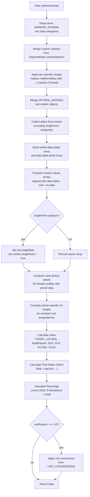

# Data Pipeline

`getActiveData()` in `js/data.js` is the central data pipeline. Every view — dashboard, category charts, compare, correlations, glossary, AI context — calls it to get processed data. It is a pure function with no side effects; it reads from `state` and returns a fresh `data` object each time.

## Pipeline flowchart



The caller is responsible for applying date range filtering after receiving `data`:

```js
const data = getActiveData();
filterDatesByRange(data);   // mutates data.dates, data.dateLabels, marker.values in-place
```

## Marker key convention

Markers are always referenced as `"category.markerKey"`:

```
biochemistry.glucose
hormones.testosterone
lipids.triglycerides
hematology.wbc
```

This format is used in:
- `UNIT_CONVERSIONS` keys
- `OPTIMAL_RANGES` keys
- `PHASE_RANGES` keys
- `importedData.entries[].markers` — each entry stores its values keyed this way
- `importedData.customMarkers` — custom marker definitions
- AI prompt references in `buildMarkerReference()`

## Entry storage format

`importedData.entries` is an array of lab snapshots. Each entry has a date and a flat markers object:

```js
{
  date: "2025-03-15",
  markers: {
    "biochemistry.glucose": 5.2,
    "hormones.testosterone": 18.4,
    "lipids.triglycerides": 1.1,
    // ...
  }
}
```

Multiple entries on the same date are merged (via `Object.assign`) into a single lookup slot. The pipeline builds `entryLookup: { "2025-03-15": { "biochemistry.glucose": 5.2, ... } }` before populating values arrays.

## Values arrays — aligned with dates

Every marker in the output has a `values` array aligned with `data.dates`:

```js
data.dates   = ["2024-09-01", "2024-12-01", "2025-03-15"]
marker.values = [4.8,          5.1,          null         ]
//                                           ^ no result for this date
```

`null` means the marker was not measured on that date. Charts use `spanGaps: true` to draw lines across gaps. Status functions check for `null` before evaluating.

## singlePoint categories

The `fattyAcids` category has `singlePoint: true` in the schema. These markers typically come from a single test, not a time series. The pipeline handles them differently:

- Only the **latest** entry date is used, stored as `cat.singleDate`
- Each marker gets `marker.singlePoint = true` and a single-element `marker.values` array
- Views render grid cards instead of trend charts for these categories

## Custom markers

Markers not in `MARKER_SCHEMA` are auto-imported from PDFs. The pipeline merges them into `data.categories` at runtime:

```js
// importedData.customMarkers:
{
  "mylab.cortisol": {
    name: "Cortisol (AM)",
    unit: "nmol/L",
    refMin: 170,
    refMax: 720,
    categoryLabel: "My Lab"
  }
}
```

If the category key does not exist in the schema, a new category is created with a bookmark icon. Custom markers have `marker.custom = true` and are treated identically to schema markers in all views.

## Calculated markers

These are computed in-pipeline and stored in the `calculatedRatios` category:

| Marker key | Formula |
|---|---|
| `tgHdlRatio` | Triglycerides / HDL |
| `ldlHdlRatio` | LDL / HDL |
| `apoBapoAIRatio` | ApoB / ApoAI |
| `nlr` | Neutrophils / Lymphocytes |
| `plr` | Platelets / Lymphocytes |
| `deRitisRatio` | AST / ALT |
| `copperZincRatio` | Copper / Zinc |
| `freeWaterDeficit` | `TBW × (Na / 140 − 1)` — assumes 70 kg body weight |
| `phenoAge` | Levine 2018 — 9 biomarkers + chronological age from DOB |

PhenoAge returns `null` if any of its 9 required inputs is missing or if DOB is not set.

## The `data` parameter pattern

`getActiveData()` deep-clones the full schema on every call — it is not free. Views accept an optional `data` parameter so a single pipeline run can feed multiple renders:

```js
// Good: one pipeline call, passed to all sub-renders
function refreshAll() {
  const data = getActiveData();
  filterDatesByRange(data);
  showDashboard(data);
}

// Bad: each sub-render calls getActiveData() independently
function refreshAll() {
  showDashboard();        // calls getActiveData() internally
  showCategory(cat);     // calls getActiveData() again
}
```

When writing a new rendering function, always accept `data` as an optional parameter and call `getActiveData()` only when it is not provided.
